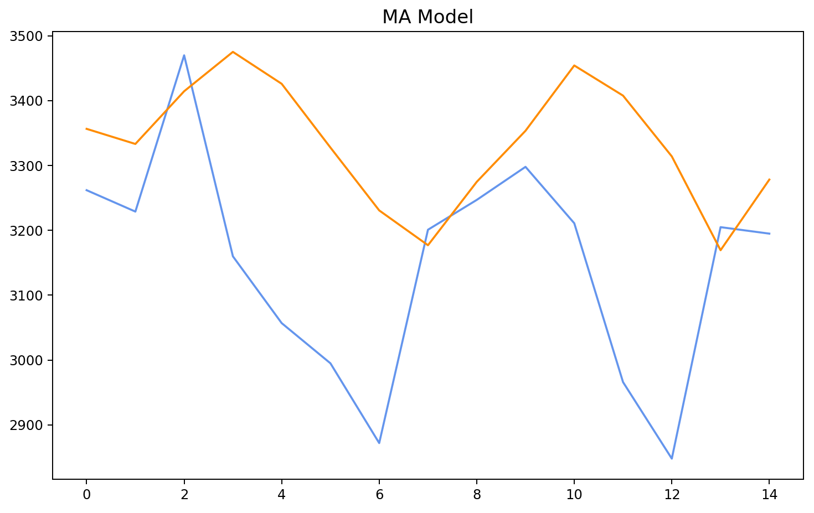
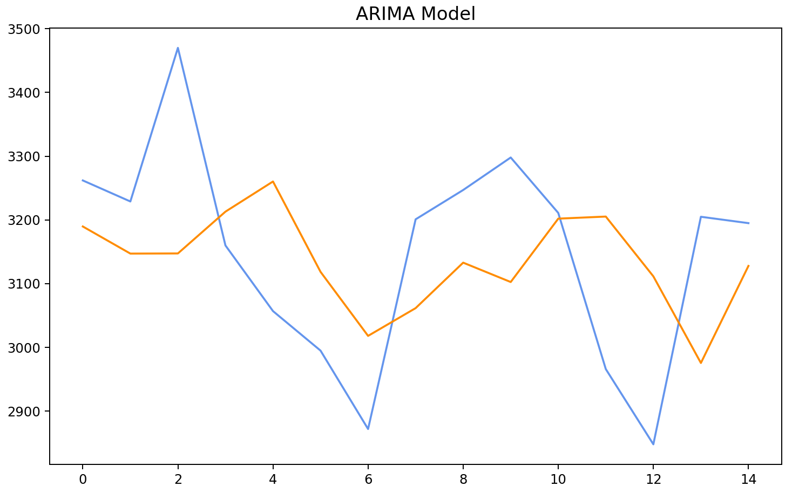
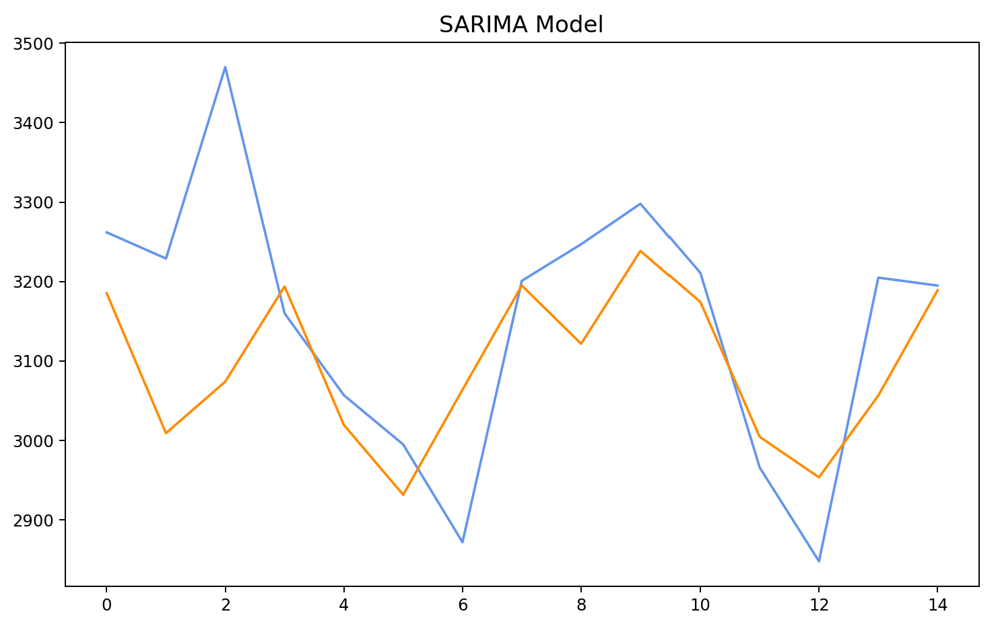

# DSAI-Electricity_Forecast

## 如何使用
沒有吃任何新的參數，只要 ```python app.py``` 就可以了~。
```
pip install -r requirements.txt
python app.py
```

## 資料
- 2022 的資料會在程式執行時從[助教提供的網址](https://data.taipower.com.tw/opendata/apply/file/d006002/本年度每日尖峰備轉容量率.csv)載下來。
    - 雖然抓資料時會抓到 3/30 之後的資料，但最後的預測結果只會用 d-1 之前的資料推測。如果要保證程式預測時沒有看到 3/30 之後的資料，可以把第 49 行 uncomment，使用預先載好的資料。
- 過去資料的部分收集了 2019、2020、2021 的備轉容量。但是在之後的嘗試中，發現好像沒什麼差，所以最後只保留了 [2021](data2021.csv) 的部分。

## 處理
對收集來的資料進行了簡單的處理...
- 把萬瓩換成 MW
- 捨去了不需要的 column
- 把兩個 csv 合併

之後參考了網路上教的 adfuller test 和 kpss test，發現這些時間序列的資料並不是 stationary 的。後來參考了另一個人教的一些轉換成 stationary 的方法，不過看來都沒有成功。

## 預測
預測的方面最後採用了 SARIMA。另外還嘗試了 MA 和 ARIMA，但是結果比較差。以 2021 的 3/30 到 4/13 做測試的話結果如下：
- MA (RMSE = 255)


- ARIMA (RMSE = 173)


- SARIMA (RMSE = 142)


以方均根差衡量的話，MA 差的比較多，而 ARIMA 和 SARIMA 其實差不多。
- 我在 SARIMA(p,d,q,s) 的 s 部分選擇 7 天為一個週期，因為我自以為人類的用電行為應該是每個禮拜周而復始的。
- 為了試圖把 non-staionary 換成 stationary，我在 d 的部分嘗試了各種數字，最後發現還是 1 次的效果最好。
- p 的部分也是嘗試了各個數字，最後選擇了 4。其實選哪個好像沒什麼差，不過還是選了一個隨機抽查幾個日期時表現最好的。

## 小結語
在測試的時候，每個日期得到的方均根差結果差很多。不過...這個部分我就覺得有點靠運氣了...